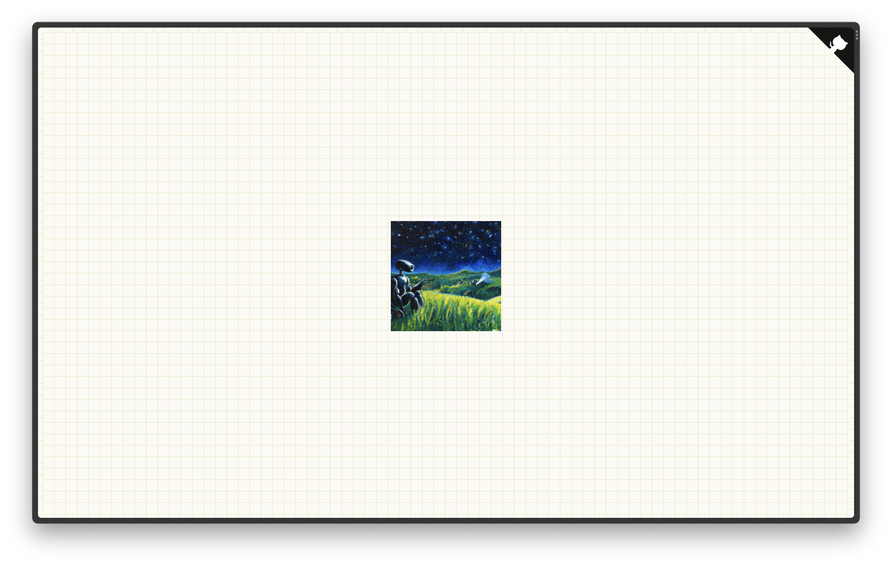

# 🎩 javi-pfp-rotator

The code that powers my profile picture on the Hack Club Slack.

## 🔎 About

This repo automates my profile picture in the Hack Club Slack! 
Powered by a serverless function deployed on Vercel, being pinged by https://cron-job.org/ every 15 minutes as well as a [web dashboard](https://javi-pfp-rotator.vercel.app/).

## 🛠️ Contributing

This project is **_not_ accepting major contributions** as it is personal. However, if there is an issue — like a spelling or grammatical error, a visual bug, or other kinds of weird things happening — please feel free to [create an issue](https://github.com/j-cordz/javi-pfp-rotator/issues/new).

If you would like to leave comments about the source code — like possible design and code improvements, or other kinds of feedback — please feel free to [create an issue](https://github.com/j-cordz/javi-pfp-rotator/issues/new) too if you wish!

## 📜 License

This repository is made open-source with the [MIT License](LICENSE), meaning that you are allowed to modify and distribute the source code as well as use it for private and commercial use provided that the licence and copyright notices are retained. For more information, visit the link above to learn what is permitted by the licence.
